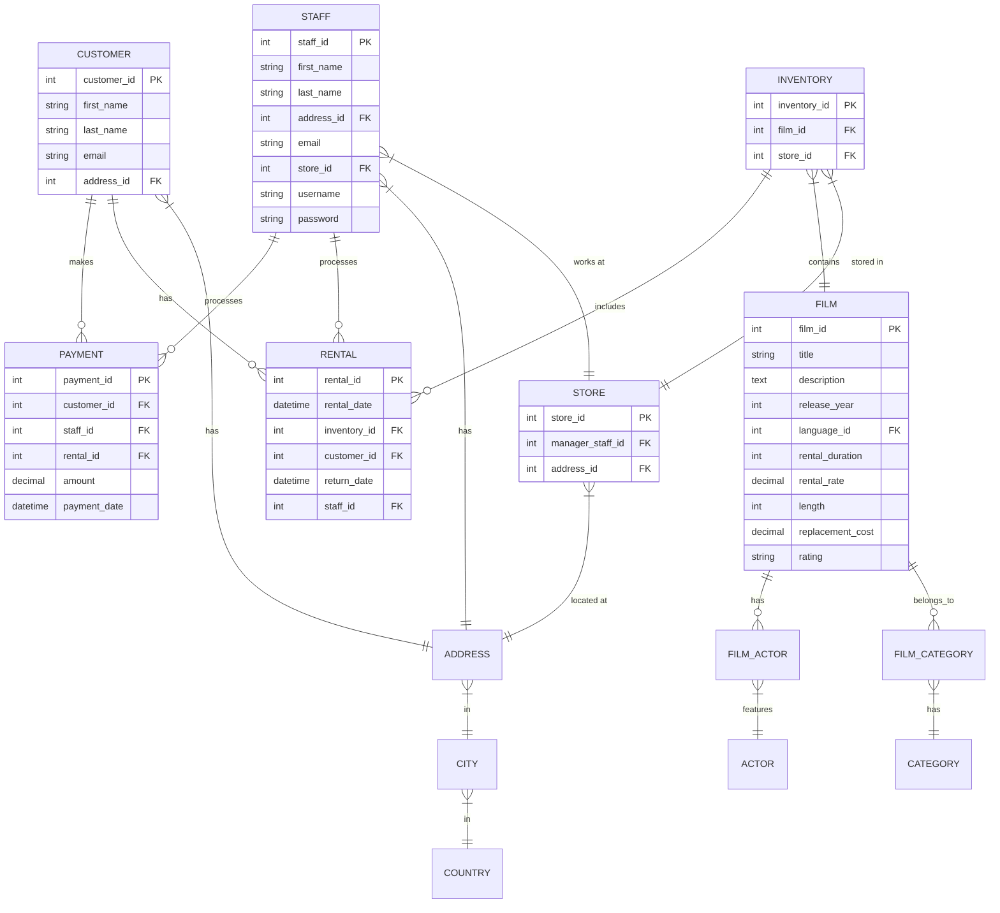

# Sakila-app

## データベースのセットアップ

```sh
docker compose up -d
docker compose exec db bash
mysql -u root -p
source /docker-entrypoint-initdb.d/1_sakila-schema.sql;
source /docker-entrypoint-initdb.d/2_sakila-data.sql;
```

## テーブル設計

| テーブル名 | 定義                             |
| ---------- | -------------------------------- |
| film       | リリース済みでレンタル可能な映画 |
| actor      | 映画に出演している俳優           |
| customer   | 顧客                             |
| category   | 映画のジャンル                   |
| payment    | 顧客が支払ったレンタル料         |
| language   | 映画の元の言語と対応している言語 |
| film_actor | 俳優と出演した映画               |
| inventory  | レンタル可能な映画の在庫         |

### ER 図


